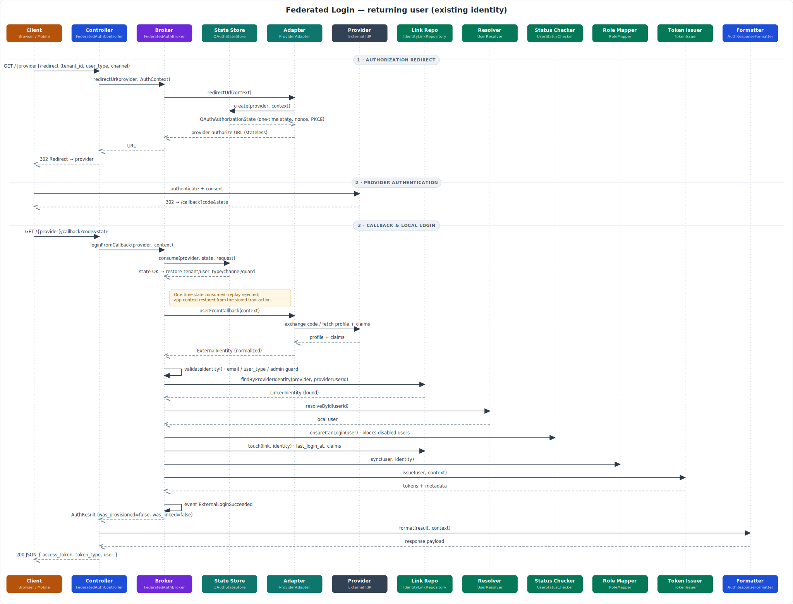
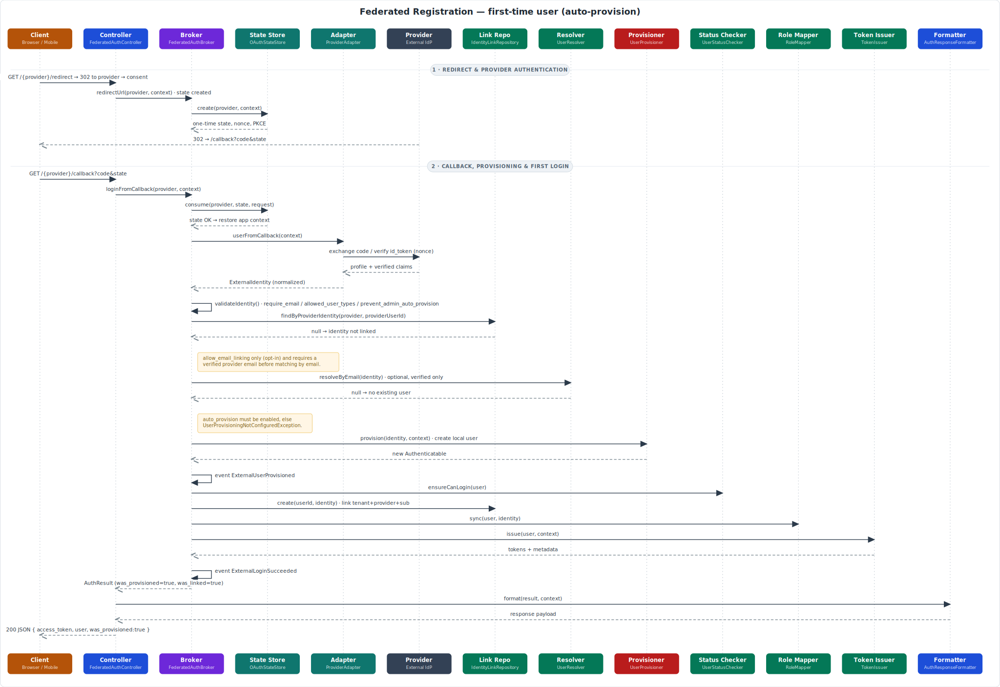

# Laravel Federated Auth

<p align="center">
  <strong>Production-ready federated authentication bridge for Laravel 11/12, OAuth2, OpenID Connect, Socialite, Apple, Keycloak and custom multi-tenant user systems.</strong>
</p>

<p align="center">
  
  
  
  
  
</p>

---

## Overview

`ronu/laravel-federated-auth` is a **contract-first Laravel package** for integrating external identity providers into real Laravel applications without forcing a specific user model, database schema, guard, token system or tenancy strategy.

It is designed for applications where social login is not enough:

- custom `users` tables;
- UUID or non-standard primary keys;
- multi-tenant identity links;
- `Client`, `Admin`, `Veterinarian`, `Technician` or other user types;
- JWT/API guards instead of session auth;
- custom role and permission systems;
- Keycloak or enterprise OIDC;
- native/mobile clients sending `id_token` directly;
- Apple private relay emails;
- secure redirect flows with package-managed `state`, plus OIDC `nonce` and PKCE where the adapter controls the code flow.

---

## Supported providers

| Provider | Flow support | Notes |
|---|---|---|
| Google | Redirect + token | Socialite adapter with package-managed one-time `state`. |
| Facebook | Redirect + token | Socialite adapter with package-managed one-time `state`; email verification trust is opt-in. |
| Apple | Redirect + native `id_token` | Dedicated OIDC-style adapter with Apple client secret JWT, nonce and PKCE for code flow. |
| Keycloak | Redirect + token | Enterprise OIDC with roles/groups, nonce and PKCE for code flow. |
| Generic OIDC | Redirect + token | Auth0, Azure AD, Okta or custom OIDC providers with nonce and PKCE for code flow. |

---

## Architecture

```text
Provider
   ↓
Provider Adapter
   ↓
ExternalIdentity DTO
   ↓
UserResolver / UserProvisioner
   ↓
IdentityLinkRepository
   ↓
RoleMapper
   ↓
TokenIssuer
   ↓
AuthResult / AuthResponseFormatter
```

The provider proves **external identity**. Your Laravel application owns the local user, tenant scope, roles, account status, local token and response format.

---

## Sequence diagrams

The following diagrams trace the full request pipeline end to end, from the HTTP entry point through `FederatedAuthBroker` and the extension contracts down to the JSON response.

Both use the **browser redirect flow**. The **native / mobile token flow** (`POST /{provider}/token` → `loginFromToken()`) skips the redirect and state-consumption phases (steps 1–2) and enters the broker at `authenticateIdentity()` — every step from `validateIdentity()` onwards is identical.

### Login — returning user (existing identity)

An external identity that is already linked to a local user. The broker resolves the user, enforces account status, touches the link and issues a local token. No user is created (`was_provisioned=false`, `was_linked=false`).



### Registration — first-time user (auto-provision)

No linked identity exists. After the security validations, the broker optionally matches by verified email, then provisions a new local user (only when `auto_provision` is enabled), creates the identity link and issues a token (`was_provisioned=true`, `was_linked=true`).



> Diagrams are generated as standalone SVGs under [`docs/diagrams`](docs/diagrams).

---

## Installation

```bash
composer require ronu/laravel-federated-auth

php artisan vendor:publish --tag=federated-auth-config
php artisan vendor:publish --tag=federated-auth-migrations
php artisan migrate
```

Optional documentation publish:

```bash
php artisan vendor:publish --tag=federated-auth-docs
```

---

## Requirements

| Dependency | Version |
|---|---:|
| PHP | `^8.2` |
| Laravel / Illuminate | `^11.0` or `^12.0` |
| Laravel Socialite | `^5.15` |
| Guzzle | `^7.8` |
| firebase/php-jwt | `^6.10` |

---

## Quick configuration

```env
FEDERATED_AUTH_ENABLED=true
FEDERATED_AUTH_ROUTES_ENABLED=true
FEDERATED_AUTH_ROUTES_PREFIX=api/auth/federated

FEDERATED_AUTH_GOOGLE_ENABLED=true
GOOGLE_CLIENT_ID=your-google-client-id
GOOGLE_CLIENT_SECRET=your-google-client-secret
GOOGLE_REDIRECT_URI=https://api.example.com/api/auth/federated/google/callback

FEDERATED_AUTH_APPLE_ENABLED=true
APPLE_CLIENT_ID=com.example.web
APPLE_TEAM_ID=TEAMID1234
APPLE_KEY_ID=ABC123DEFG
APPLE_PRIVATE_KEY_PATH=/secure/path/AuthKey_ABC123DEFG.p8
APPLE_REDIRECT_URI=https://api.example.com/api/auth/federated/apple/callback

FEDERATED_AUTH_KEYCLOAK_ENABLED=true
KEYCLOAK_BASE_URL=https://auth.example.com
KEYCLOAK_REALM=my-realm
KEYCLOAK_CLIENT_ID=my-api-client
KEYCLOAK_CLIENT_SECRET=secret
KEYCLOAK_REDIRECT_URI=https://api.example.com/api/auth/federated/keycloak/callback
```

---

## Routes

| Method | URI | Purpose |
|---|---|---|
| `GET` | `/api/auth/federated/providers` | List configured providers. |
| `GET` | `/api/auth/federated/{provider}/redirect` | Start browser redirect login. |
| `GET/POST` | `/api/auth/federated/{provider}/callback` | Handle provider callback. |
| `POST` | `/api/auth/federated/{provider}/token` | Native/mobile token login. |
| `POST` | `/api/auth/federated/{provider}/link/token` | Link provider identity to authenticated user. |
| `DELETE` | `/api/auth/federated/{provider}/unlink` | Unlink provider identity. |

---

## Browser redirect flow

```text
GET /api/auth/federated/google/redirect?tenant_id=clinic-1&user_type=Client&channel=web
        ↓
Create one-time OAuthAuthorizationState
        ↓
Redirect to provider
        ↓
Callback returns code + state
        ↓
Consume state once
        ↓
Restore tenant_id, user_type, channel, guard and redirect_uri
        ↓
Normalize ExternalIdentity
        ↓
Resolve or provision local user
        ↓
Create/touch identity link
        ↓
Issue local API token
```

Provider callbacks usually return only `code` and `state`. The package restores the original application context from the consumed state before resolving or creating a provider identity link.

**Important security scope:** Socialite-backed redirect providers such as Google and Facebook get package-managed one-time `state` validation. OIDC `nonce` validation and PKCE are applied by OIDC-style adapters that control the code flow, such as Apple, Keycloak and generic OIDC providers.

---

## Native / mobile token flow

Mobile clients can authenticate using the provider SDK and send the provider token to Laravel.

```http
POST /api/auth/federated/keycloak/token
Content-Type: application/json

{
  "id_token": "provider-id-token",
  "tenant_id": "clinic-1",
  "user_type": "Client",
  "channel": "mobile"
}
```

```http
POST /api/auth/federated/keycloak/token
Content-Type: application/json

{
  "access_token": "provider-access-token",
  "tenant_id": "clinic-1",
  "user_type": "Client",
  "channel": "mobile"
}
```

OIDC token handling is explicit:

| Submitted field | Behavior |
|---|---|
| `id_token` | Decode and validate as an OIDC ID token. |
| `access_token` | Call `userinfo_endpoint` when configured. |
| unknown | JWT-looking values are treated as ID tokens. |

---

## Response example

```json
{
  "success": true,
  "was_provisioned": false,
  "was_linked": false,
  "user": {
    "id": 25,
    "uuid": "4d78f4fb-70ef-45ef-b98a-d143d39464a3",
    "email": "client@example.com",
    "user_type": "Client",
    "auth_identifier": 25
  },
  "access_token": "local-jwt-token",
  "token_type": "bearer",
  "expires_in": 3600,
  "metadata": []
}
```

The response is configurable through `AuthResponseFormatterInterface`, so you can expose only safe user fields.

---

## Security posture

The package is secure-by-design for redirect and token flows, with provider-specific coverage:

- all package-managed redirect flows can use one-time OAuth `state`;
- all package-managed redirect flows can reject replay through state consumption;
- all package-managed redirect flows can use optional user-agent/IP fingerprint binding;
- Apple, Keycloak and generic OIDC code flows can use OIDC `nonce` validation;
- Apple, Keycloak and generic OIDC code flows can use PKCE;
- redirect host validation protects dynamic redirect URIs;
- tenant-aware callback context restoration prevents callback logins from losing tenant scope;
- native/mobile OIDC token flows preserve explicit `id_token` vs `access_token` handling;
- provider tokens are not stored by default;
- public social providers should not auto-provision privileged users.

Recommended production settings:

```env
FEDERATED_AUTH_OAUTH_STATE_ENABLED=true
FEDERATED_AUTH_OAUTH_STATE_TTL_SECONDS=300
FEDERATED_AUTH_OAUTH_STATE_BIND_USER_AGENT=true
FEDERATED_AUTH_PKCE_ENABLED=true
FEDERATED_AUTH_OIDC_NONCE_ENABLED=true
FEDERATED_AUTH_ALLOWED_REDIRECT_HOSTS=api.example.com,app.example.com
FEDERATED_AUTH_ALLOW_HTTP_LOCALHOST_REDIRECTS=false
```

`FEDERATED_AUTH_PKCE_ENABLED` and `FEDERATED_AUTH_OIDC_NONCE_ENABLED` affect OIDC-style adapters that control the code flow. Socialite-backed providers such as Google and Facebook still receive package-managed `state`, but package-level nonce/PKCE is not applied there unless a dedicated adapter controls that provider flow.

---

## Identity link model

The package links external identities to local users using this conceptual key:

```text
tenant_id + provider + provider_user_id → local_user_id
```

Do not use email as the federated identity key. Apple can return private relay emails and some providers may return missing or unverified emails.

---

## Extension contracts

| Contract | Responsibility |
|---|---|
| `UserResolverInterface` | Find local users. |
| `UserProvisionerInterface` | Create local users when allowed. |
| `IdentityLinkRepositoryInterface` | Store provider identity links. |
| `TokenIssuerInterface` | Issue local tokens. |
| `RoleMapperInterface` | Sync local roles from provider claims. |
| `UserStatusCheckerInterface` | Block disabled users. |
| `OAuthStateStoreInterface` | Store and consume OAuth state. |
| `AuthResponseFormatterInterface` | Format API responses. |
| `PermissionPayloadResolverInterface` | Append optional permission payloads. |

---

## Optional `ronu/rest-generic-class` integration

The package can integrate with `ronu/rest-generic-class` without depending on it directly.

```bash
composer require ronu/rest-generic-class
```

```env
FEDERATED_AUTH_RESPONSE_INCLUDE_PERMISSIONS=true
FEDERATED_AUTH_RGC_ENABLED=true
```

This enables an `ok/data/meta` response shape and optional effective permissions in login responses.

---

## Provider recommendations

| Provider | Recommended use |
|---|---|
| Google | Client login with verified email and package-managed state. |
| Facebook | Public login with package-managed state; do not trust email verification unless explicitly configured. |
| Apple | Native/mobile or web login; use `sub` as identity key, not email. |
| Keycloak | Enterprise login, nonce/PKCE-capable code flow and controlled role/group mapping. |
| Generic OIDC | Auth0, Azure AD, Okta or custom identity servers with OIDC nonce/PKCE support. |

---

## Documentation

Full documentation lives in [`docs`](docs).

Recommended starting points:

- [`docs/00-simple-guide.md`](docs/00-simple-guide.md)
- [`docs/03-core-architecture.md`](docs/03-core-architecture.md)
- [`docs/08-security-and-edge-cases.md`](docs/08-security-and-edge-cases.md)
- [`docs/12-oauth-hardening.md`](docs/12-oauth-hardening.md)
- [`docs/13-apple-provider.md`](docs/13-apple-provider.md)
- [`docs/14-rest-generic-class-integration.md`](docs/14-rest-generic-class-integration.md)
- [`docs/15-guide-integration.md`](docs/15-guide-integration.md)

---

## Testing

```bash
composer install
vendor/bin/phpunit
vendor/bin/pint --test
```

---

## Production checklist

- [ ] Configure allowed redirect hosts.
- [ ] Keep OAuth state enabled.
- [ ] Keep OIDC nonce enabled for OIDC-style providers that control the code flow.
- [ ] Keep PKCE enabled for OIDC-style providers that control the code flow.
- [ ] Do not assume Socialite-backed Google/Facebook redirects have package-level nonce/PKCE unless using a dedicated adapter.
- [ ] Do not trust Facebook email verification unless intentionally configured.
- [ ] Do not auto-provision privileged users from public social providers.
- [ ] Confirm tenant scoping in `IdentityLinkRepository`.
- [ ] Confirm token issuer uses the expected guard.
- [ ] Confirm provider tokens are not stored unless needed.
- [ ] Run PHPUnit and Pint before release.

---

## Philosophy

```text
External providers authenticate identity.
Your Laravel application owns authorization.
```

That separation keeps the package flexible enough for startups, SaaS products, enterprise systems and modular Laravel platforms.

---

## License

The MIT License (MIT). Please see [`LICENSE.md`](LICENSE.md) for more information.
